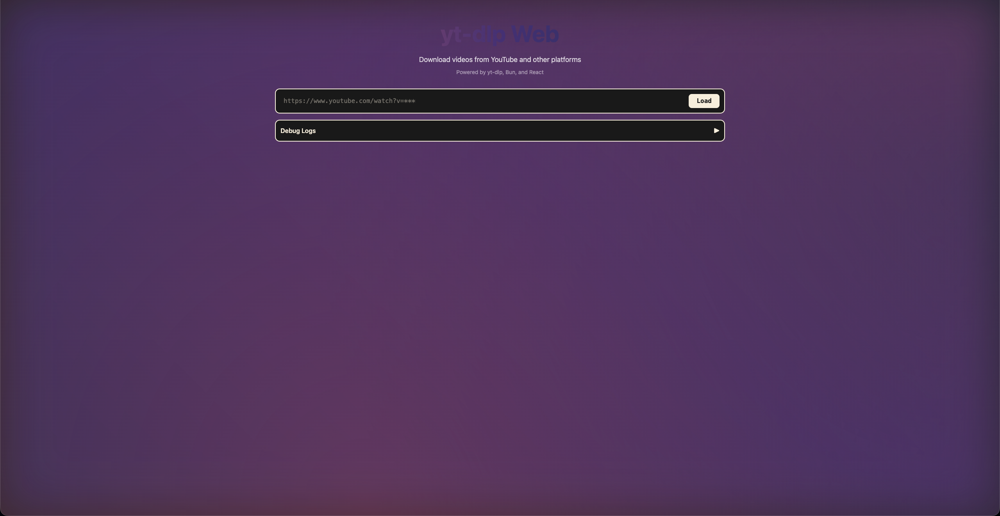
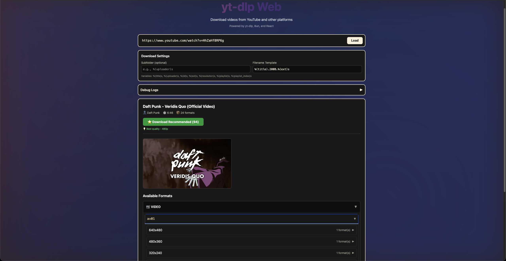
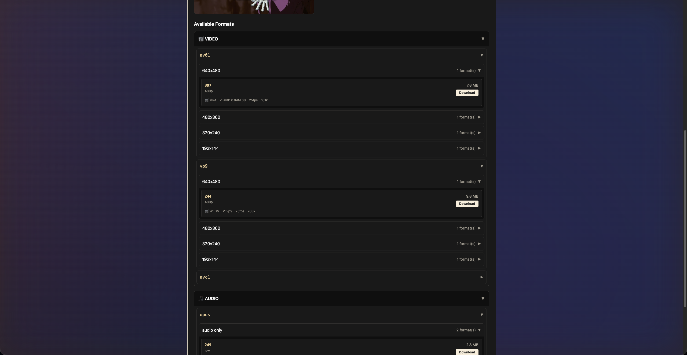
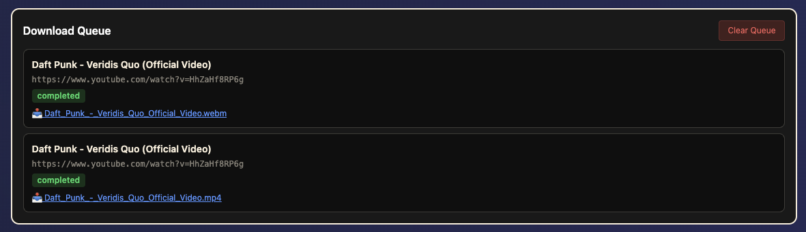

# yt-dlp Web App

A modern web interface for yt-dlp with real-time download progress, playlist support, and custom naming options.

## Screenshots


*Main interface with video metadata and format selection*


*Playlist selection with per-item format configuration*


*Real-time download progress with dual progress bars for playlists*


*Detailed format information organized by codec and resolution*

## Features

✨ **Modern UI** - Clean, dark-themed interface with collapsible format groups  
🎯 **Smart Recommendations** - Automatically suggests the best format based on codec and quality  
📊 **Real-time Progress** - WebSocket-based live download progress with speed and ETA  
🎵 **Playlist Support** - Download entire playlists or select specific videos  
📁 **Custom Paths** - Configure subfolders and filename templates with variables  
⚡ **Concurrent Downloads** - Up to 3 simultaneous downloads with queue management  
🔍 **Detailed Metadata** - View all available formats organized by type, codec, and resolution  
📥 **File Serving** - Download completed files directly through the web interface

## Prerequisites

- [Bun](https://bun.sh) runtime
- [yt-dlp](https://github.com/yt-dlp/yt-dlp) installed and available in PATH

Install yt-dlp:

```bash
# macOS
brew install yt-dlp

# Or using pip
pip install yt-dlp
```

## Installation

```bash
# Install dependencies
bun install

# Configure download directory (optional)
cp .env.example .env
# Edit .env to set your preferred DOWNLOAD_DIR
```

## Usage

### Development Mode

```bash
bun dev
# Opens at http://localhost:3000
```

### Production Build

```bash
# Build the project
bun run build.ts

# Start production server
bun start
```

### Docker Deployment

**Using Docker Compose (Recommended):**

```bash
# Build and start
docker-compose up -d

# View logs
docker-compose logs -f

# Stop
docker-compose down
```

**Using Docker directly:**

```bash
# Build image
docker build -t yt-dlp-web .

# Run container
docker run -d \
  -p 3000:3000 \
  -v $(pwd)/downloads:/downloads \
  -v $(pwd)/data:/app/data \
  -e DOWNLOAD_DIR=/downloads \
  --name yt-dlp-web \
  yt-dlp-web

# View logs
docker logs -f yt-dlp-web
```

The Docker image includes:

- Bun runtime
- yt-dlp and ffmpeg pre-installed
- Health checks for monitoring
- Volume mounts for persistent downloads and queue state

## Environment Variables

Create a `.env` file in the root directory:

```env
DOWNLOAD_DIR=~/Downloads/yt-dlp-web
PORT=3000
```

If not specified, defaults to `~/Downloads/yt-dlp-web` and port 3000.

## Data Persistence

The app persists download queue state to `data/queue-state.json`:

- Jobs are automatically restored on server restart
- Downloading jobs resume as pending
- Completed/failed jobs retain their status
- Queue state saves automatically with 1-second debounce

## Features Guide

### Metadata Fetching

1. Enter any YouTube URL (video or playlist)
2. Click "Load" to fetch metadata
3. View video info, thumbnail, and all available formats

### Download Options

**Quick Downloads:**

- **Download Best Quality** - Automatically selects best video+audio format
- **Download Recommended** - Uses the smart recommendation (prioritizes AV1/VP9 codecs)

**Custom Downloads:**

- Click "Download" on any specific format in the format list
- Set custom subfolder and filename template
- Use template variables like `%(title)s`, `%(uploader)s`, `%(resolution)s`

### Playlist Downloads

When loading a playlist:

1. All videos are displayed with checkboxes
2. Select specific videos or use "Select All"
3. Configure output settings
4. Download selected videos

### Template Variables

Available filename/subfolder variables:

- `%(title)s` - Video title
- `%(uploader)s` - Channel name
- `%(id)s` - Video ID
- `%(ext)s` - File extension
- `%(resolution)s` - Video resolution (e.g., 1080p)
- `%(playlist)s` - Playlist name
- `%(playlist_index)s` - Video position in playlist

Example templates:

```
%(uploader)s/%(title)s.%(ext)s
%(playlist)s/%(playlist_index)s - %(title)s.%(ext)s
%(uploader)s/%(upload_date)s - %(title)s.%(ext)s
```

### Download Queue

- View all active, pending, and completed downloads
- Real-time progress bars with percentage, speed, and ETA
- Cancel pending or active downloads
- Download completed files directly from the interface
- Playlist downloads show "Video X/Y" progress

## Architecture

### Backend (Bun + TypeScript)

- **REST API** - Metadata fetching, download management
- **WebSocket Server** - Real-time progress streaming
- **Download Queue** - Manages concurrent downloads (max 3)
- **yt-dlp Integration** - Spawns processes with streaming output parsing

### Frontend (React 19 + Tailwind CSS)

- **WebSocket Client** - Real-time updates
- **Hierarchical Format Display** - Type → Codec → Resolution grouping
- **Download Controls** - Custom paths, playlist selection
- **Progress Tracking** - Live updates for all downloads

## API Endpoints

### REST API

```
GET  /api/link/metadata?url=<video_url>  - Fetch video/playlist metadata
POST /api/download                        - Start download (body: DownloadRequest)
GET  /api/download/:id                    - Get download job status
DELETE /api/download/:id                  - Cancel download
GET  /api/downloads                       - List all downloads
GET  /api/files/:filename                 - Download completed file
```

### WebSocket Messages

**Client → Server:**

```json
{ "type": "download-request", "payload": { "url": "...", "format_id": "...", ... } }
{ "type": "subscribe", "payload": { "jobId": "..." } }
{ "type": "download-cancel", "payload": { "jobId": "..." } }
{ "type": "queue-status", "payload": {} }
```

**Server → Client:**

```json
{ "type": "download-started", "payload": { "jobId": "..." } }
{ "type": "download-progress", "payload": { "jobId": "...", "progress": {...} } }
{ "type": "download-complete", "payload": { "jobId": "...", "files": [...] } }
{ "type": "download-error", "payload": { "jobId": "...", "error": "..." } }
{ "type": "queue-status", "payload": { "jobs": [...] } }
```

## Project Structure

```
src/
├── index.ts              # Server entry point with WebSocket
├── types.ts              # TypeScript type definitions
├── apps/
│   ├── backend/
│   │   ├── backend.ts         # WebSocket handler & queue manager
│   │   ├── routes.ts          # REST API routes
│   │   ├── yt-dlp-cli.ts      # yt-dlp integration
│   │   └── download-queue.ts  # Download queue manager
│   └── frontend/
│       ├── App.tsx            # Main app component
│       ├── LinkField.tsx      # URL input & download controls
│       ├── Metadata.tsx       # Format display & download buttons
│       ├── frontend.tsx       # Frontend entry
│       ├── index.html         # HTML template
│       └── index.css          # Tailwind styles
```

## Technologies

- **Runtime:** [Bun](https://bun.sh) - Fast JavaScript runtime with built-in WebSocket
- **Backend:** TypeScript with Bun's native APIs
- **Frontend:** React 19 with Tailwind CSS 4
- **Video Downloader:** [yt-dlp](https://github.com/yt-dlp/yt-dlp)
- **Real-time:** Native Bun WebSocket

## License

MIT

---

Built with ❤️ using Bun, React, and yt-dlp
